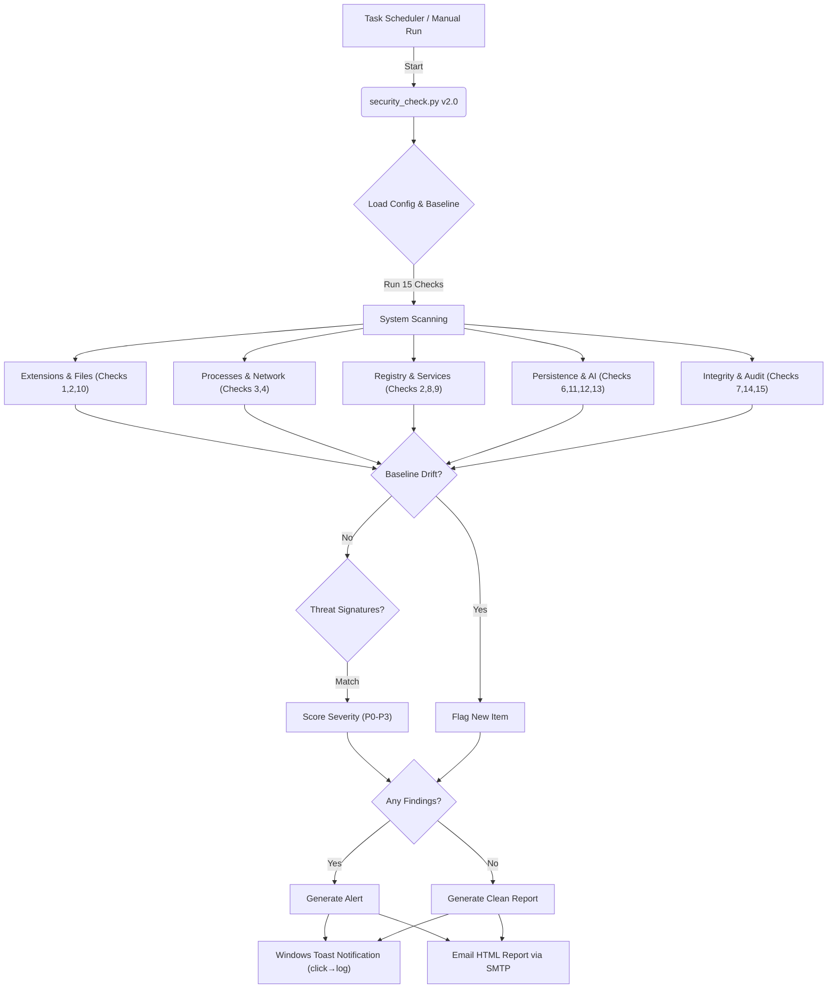

# Security Monitor v2.0 — Enterprise EDR for Windows

> Lightweight, automated daily security monitor with **15 detection vectors**, baseline drift detection, MITRE ATT&CK coverage, and structured reporting.

## Why This Was Created
In an era where threats like cryptominers, remote access trojans (RATs), and prompt-injections via AI tools (like OpenClaw, Claude, MCP) are increasingly common, relying on Windows Defender alone isn't always enough. Security Monitor acts as a **proactive, customizable second layer** to hunt for the threats that slip through.

## Architecture & Flow



## Detection Coverage (MITRE ATT&CK)

| # | Check | Technique | MITRE ID | Severity |
|---|-------|-----------|----------|----------|
| 1 | Chrome Extensions | Browser Extensions | T1176 | P0-P1 |
| 2 | Startup Registry | Registry Run Keys | T1547.001 | P0-P1 |
| 3 | Running Processes | Process Injection | T1055 | P0-P1 |
| 4 | Network Connections | C2 Communication | T1071 | P0-P2 |
| 5 | Hosts File | DNS Hijacking | T1565.001 | P0 |
| 6 | AI Tool Configs | Prompt Injection | T1401 | P1-P2 |
| 7 | Windows Defender | Impair Defenses | T1562.001 | P0 |
| 8 | Scheduled Tasks | Scheduled Task | T1053.005 | P0-P2 |
| 9 | Windows Services | Create/Modify Service | T1543.003 | P0-P2 |
| 10 | Startup Folders | Startup Items | T1547.001 | P0-P1 |
| 11 | WMI Persistence | WMI Subscription | T1546.003 | P0 |
| 12 | PowerShell Profiles | PowerShell Profile | T1546.013 | P1 |
| 13 | BITS Jobs | BITS Job | T1197 | P1 |
| 14 | Self-Integrity | Indicator Removal | T1070 | P0-P1 |
| 15 | Event Log Audit | Security Events | T1654 | P1-P2 |

## vs. Commercial EDR Tools

| Feature | Security Monitor v2 | Sysmon (Free) | CarbonBlack |
|---------|-------------------|---------------|-------------|
| Cost | Free / MIT | Free | ~$25/endpoint |
| Setup | ~5 min interactive | Complex XML | Enterprise deployment |
| Email alerts | ✅ Built-in | ❌ | ✅ |
| Baseline drift | ✅ | ❌ | ✅ |
| WMI persistence | ✅ | ✅ | ✅ |
| AI config scanning | ✅ | ❌ | ❌ |
| Prompt injection | ✅ | ❌ | ❌ |
| Windows notification | ✅ | ❌ | ✅ |
| Script < 2000 lines | ✅ | N/A | N/A |

## Detection Modes

| Mode | Sensitivity | Use Case |
|------|------------|----------|
| `paranoid` | High (lower thresholds) | Security professionals, servers |
| `standard` | Balanced | Personal daily use **[default]** |
| `light` | Minimal | Low-end machines, fastest scan |

## Getting Started

### Clone the Repo
```powershell
# Navigate to where you want to store the app
cd C:\Users\YourName\Documents
git clone https://github.com/Amitro123/security_monitor.git
cd security_monitor
```

### Run Setup (as Administrator)
1. Click **Start** → search **PowerShell**
2. Right-click → **"Run as administrator"**
3. Run:
```powershell
powershell -ExecutionPolicy Bypass -File .\setup.ps1
```

The interactive setup will ask you for:
- 📧 **Gmail address** (optional, for email reports)
- 🔑 **Gmail App Password** (NOT your real password — see below)
- ⏰ **Run time** (default: `09:00`)
- 🔧 **Detection mode** (`paranoid` / `standard` / `light`)

### Gmail App Password
Google blocks script login with your normal password. You need a 16-letter App Password:
1. Go to [https://myaccount.google.com/apppasswords](https://myaccount.google.com/apppasswords)
2. Create a new app → name it "Security Monitor"
3. Copy the **16-letter code** (e.g. `abcd efgh ijkl mnop`) — enter it **without spaces**

After setup, credentials are stored securely in **Windows Credential Manager** — not in any plain-text file.

## Usage & Commands

```powershell
# Normal daily scan
python security_check.py

# Simulate 5 threats (verify email + notification)
python security_check.py --test

# Diagnose install problems
python security_check.py --doctor

# Regenerate baseline snapshot
python security_check.py --baseline
```

## Files & Directory Layout

```
security_monitor/
├── security_check.py        ← EDR engine (15 checks)
├── setup.ps1                ← Interactive installer
├── config.json              ← Your settings (gitignored!)
├── baseline.json            ← System snapshot (gitignored!)
├── security_log.txt         ← Human-readable event log
├── security_log.json        ← Structured JSON log (SIEM-ready)
├── baseline.example.json    ← Schema reference
├── CHANGELOG.md             ← Release history
├── SECURITY.md              ← Vulnerability disclosure
└── .github/
    └── workflows/ci.yml     ← CI/CD pipeline
```

## Configuration (config.json)

```json
{
  "email": {
    "to": "your-email@gmail.com",
    "from": "your-email@gmail.com",
    "app_password": "YOUR_GMAIL_APP_PASSWORD_HERE",
    "smtp_host": "smtp.gmail.com",
    "smtp_port": 587
  },
  "mode": "standard",
  "script_hash": "<auto-generated by setup>"
}
```

## Example Log Output

```
[2026-02-25 09:00:00] ============================================================
[2026-02-25 09:00:00] Security Monitor v2.0.0 — starting
[2026-02-25 09:00:00] ============================================================
[2026-02-25 09:00:00]   > Chrome Extensions ...
[2026-02-25 09:00:00]     -> 7 extensions found – OK
[2026-02-25 09:00:01]   > WMI Persistence ...
[2026-02-25 09:00:01]     CRITICAL – WMI Consumer found: 'EvilPersist'
...
[2026-02-25 09:00:05] WARNING: 1 potential issue(s) detected (1 HIGH/CRITICAL)
[2026-02-25 09:00:06] [Email] Report sent successfully.
[2026-02-25 09:00:06] Security Monitor — done.
```

## Troubleshooting

| Problem | Solution |
|---------|----------|
| Setup fails with "Not Administrator" | Right-click PowerShell → Run as administrator |
| Email not sending | Generate an App Password at [myaccount.google.com/apppasswords](https://myaccount.google.com/apppasswords) — do NOT use your real Gmail password |
| Windows notification not showing | Run `python security_check.py --test` to verify |
| Script returns errors | Run `python security_check.py --doctor` to diagnose |
| False positive on AI configs | Review `security_log.txt` — the file path and pattern will be listed |
| Scheduled task missing | Re-run `setup.ps1` as Administrator to recreate it |

## Uninstall

```powershell
# Remove the scheduled task
Unregister-ScheduledTask -TaskName "DailySecurityMonitor" -Confirm:$false

# Remove stored credentials
cmdkey /delete:SecurityMonitor_Gmail

# Delete the folder
Remove-Item -Recurse -Force .\security_monitor
```

## Contributing

Pull requests welcome! Please:
1. Fork the repo and create a feature branch
2. Follow existing code style (type hints, docstrings)
3. Test with `--test` and `--doctor` flags before submitting
4. Update `CHANGELOG.md`

## License

MIT License — free for personal and commercial use.
