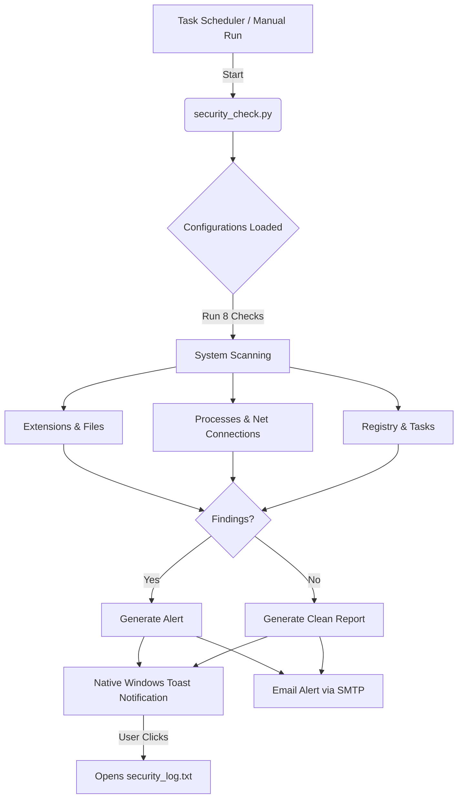

# Security Monitor — Daily Security Check

This repository provides a lightweight, automated daily security check designed to identify threats and suspicious behavior on Windows machines. 

## Why This Was Created (Motivation)
In an era where threats like cryptominers, remote access trojans (RATs), and prompt-injections via AI tools (like OpenClaw, Claude, MCP) are becoming increasingly common, relying solely on standard antivirus software isn't always enough. This script was built to provide a customized, aggressive secondary layer of defense that actively hunts for specific persistence mechanisms and modern attack vectors.

## How It Secures Your System (Coverage)
The script performs 8 critical checks:
1. **Chrome Extensions**: Scans for known malicious extensions and risky permission combinations (e.g., `nativeMessaging` + `webRequest`).
2. **Startup Items**: Checks Windows Registry Run keys for suspicious executables masking as legitimate applications.
3. **Running Processes**: Cross-references active processes against known threat signatures (miners, meterpreter, netcat).
4. **Network Connections**: Identifies unauthorized external connections to suspicious ports associated with Metasploit, Tor, or IRC botnets.
5. **Hosts File**: Detects unauthorized DNS redirection (hijacking of domains like google.com or github.com).
6. **AI Tool Configs**: Scans local AI configurations (Claude/MCP/OpenClaw) for modern prompt-injection payloads (e.g., "ignore previous instructions").
7. **Windows Defender**: Validates that real-time protection and antimalware services haven't been forcefully disabled.
8. **Scheduled Tasks**: Hunts for hidden persistence mechanisms buried in the Windows Task Scheduler.

## Architecture & Flow


## Installation / Setup

First, clone this repository to a local folder on your machine:
```powershell
# Open PowerShell and navigate to where you want to store the application
cd C:\Users\YourName\Documents
git clone https://github.com/Amitro123/security_monitor.git
cd security_monitor
```

Once downloaded, run the unified setup command as Administrator:
1. Click **Start** and search for **PowerShell**.
2. Right-click → **"Run as administrator"**.
3. In the window that opens, run:
```powershell
powershell -ExecutionPolicy Bypass -File .\setup.ps1
```

### Interactive Setup
The setup process is completely interactive!
During setup, you will be prompted to:
- **Enter a Gmail Address** to receive alerts (or you can press Enter to skip).
- **Enter a Gmail App Password** securely in the prompt.
- **Choose a Time** for the daily scheduled execution (e.g. `14:00`, or press Enter to keep `09:00`).

### Gmail App Password Requirement
**Note:** Google security prevents scripts from logging in with your normal password. During setup, you must use a **16-letter App Password**.
1. Go to [https://myaccount.google.com/apppasswords](https://myaccount.google.com/apppasswords)
2. Create a new app password named "Security Monitor".
3. Copy the 16-letter code (no spaces) provided by Google and paste it into the PowerShell prompt.

## Examples

### Example `config.json`
Running the setup dynamically generates this file to store your email configuration:
```json
{
  "email": {
    "to": "your-email@gmail.com",
    "from": "your-email@gmail.com",
    "app_password": "YOUR_GMAIL_APP_PASSWORD_HERE",
    "smtp_host": "smtp.gmail.com",
    "smtp_port": 587
  }
}
```

### Example `security_log.txt`
When the check runs, it generates an easy-to-read log outlining exactly what it found:
```text
[2026-02-25 09:00:00] ============================================================
[2026-02-25 09:00:00] Security Monitor — daily check starting
[2026-02-25 09:00:00] ============================================================
[2026-02-25 09:00:00]   > Chrome Extensions ...
[2026-02-25 09:00:00]     -> 7 extensions found, 1 suspicious
[2026-02-25 09:00:00]     High-risk extension: 'Claude' [debugger, downloads] + all-URL access
[2026-02-25 09:00:02]   > Running Processes ...
[2026-02-25 09:00:02]     -> 325 processes checked – OK
[2026-02-25 09:00:05] ============================================================
[2026-02-25 09:00:05] WARNING: 1 potential issue(s) detected — review the log.
[2026-02-25 09:00:06] [Email] Report sent successfully.
[2026-02-25 09:00:06] ============================================================
[2026-02-25 09:00:06] Security Monitor — done.
```

## Configuration & Safety

- The script creates auto-configuration in `config.json`.
- **Note:** The `config.json` stores your Gmail App Password in plain text. Do not commit this file to public repositories (a `.gitignore` is provided to keep it local). If using for personal local use, this is generally accepted, but keep it in mind.
- If you wish to disable email alerts, open `config.json` and change the app password to `YOUR_GMAIL_APP_PASSWORD_HERE`.

## Testing the Flow
To ensure that the Windows Native Action Center notification and the email system work perfectly, you can run an instant "simulated threat" test. 

Open PowerShell in the folder where the app is located and run:
```powershell
python security_check.py --test
```
This will instantly alert your Windows Action Center and send you an email detailing a `fake_miner.exe`, allowing you to confirm that the entire alert pipeline is correctly configured!

## Uninstallation

To remove the scheduled background task, open PowerShell (as Administrator) and run:
```powershell
Unregister-ScheduledTask -TaskName "DailySecurityMonitor" -Confirm:$false
```
Afterwards, you can safely delete the `security_monitor` folder.
